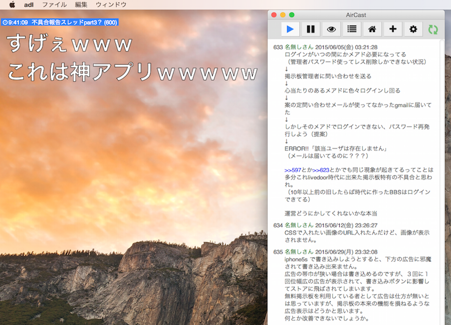

AirCast
==========

2ch互換掲示板用の字幕表示ソフト
## このアプリについて
したらば掲示板などに代表される2ch互換掲示板のスレッドの書き込みを読み込んで字幕表示してくれるアプリ。主に実況用途で使用する。Windows,MacなどAdobeAirランタイム対応のすべてのOSに対応。  
## 開発環境
npm  
bower  
Grunt  
Adobe Air 14.0  
http://get.adobe.com/jp/air/  
Adobe AIR SDK & Compiler  
http://www.adobe.com/devnet/air/air-sdk-download.html  

## コンパイル
Grunt,npm,bowerについては各自で調べて下さい。
下記コマンドでhaml,scss,coffeeの変更を検知して自動コンパイル、coffeeはconcatで./js/scripts.jsに結合。
詳細はGruntfile参照。  
```
grunt watch
```

## 起動コマンド

```
adl 2ch_jimaku/2ch_jimaku.xml
```

## パッケージ化コマンド

```
adt -package -storetype pkcs12 -keystore AirCast.pfx -storepass pass AirCast.air 2ch_jimaku.xml icons sound haml js/scripts.js lib scss/style.css bower_components node_modules
```

## 備考

ロジック系はcoffeeフォルダ内を参照 。
現在対応している掲示板はしたらばのみ  

## 実装・改良したい機能

・＠chs、２ちゃんねるに対応  
・レス書き込み機能  

## 使用素材

【同封レス着信音】  
http://maoudamashii.jokersounds.com/music_se.html  
